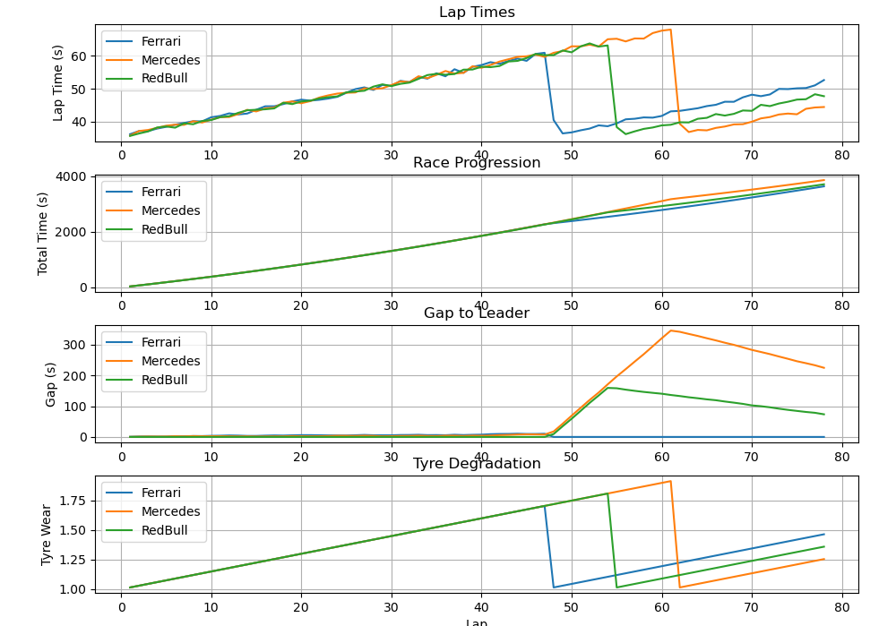

# F1 Simulation
## This repo simulates a F1 race
## Each Car Telemetry is calculated using Threads for Faster computation
 
## **Overview**
A multithread Race simulation with engine written in C++ and Python-Based telemetry analysis Visualization
## Architecture
**Python**(Orchestrator) --> **C++** Simulation Engine --> **CSV** Telemetry output --> **Visualization**(Pandas + Matplotlib)
## Features
- multithreaded car simulation
- tyre degradation model
- fuel burn
- pit strategy
- crash probability
- telemetry logging
## Performance
**Simulation Runtime: 0.015s**  
**Visualization Runtime: 2.977s**
## How to Run
`python main.py`